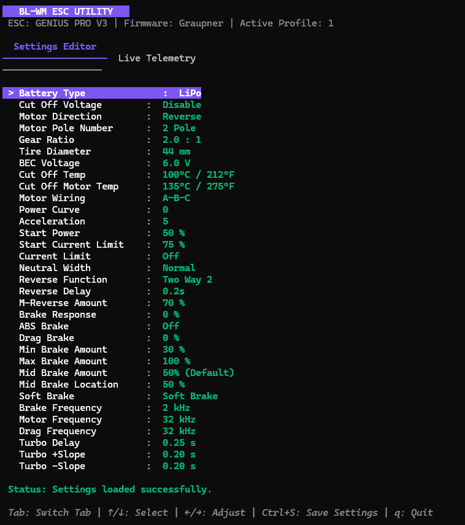
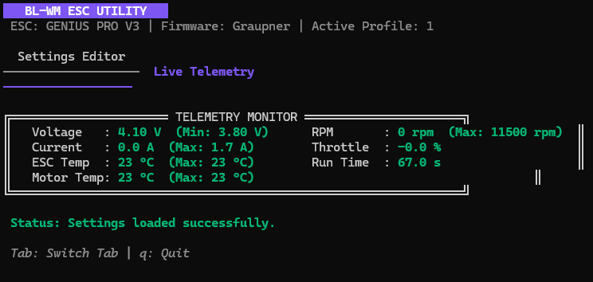

# BL-WM ESC UTILITY

A modern, cross-platform terminal user interface (TUI) and command-line utility written in Go for configuring and monitoring Yokomo & Graupner WiFi-compatible brushless ESCs (such as the Yokomo BL-WM and Graupner Genius Pro V3).

This utility serves as a modern, reliable replacement for the legacy/abandoned mobile configuration apps, restoring complete remote control and diagnostics to these high-performance ESCs.

---

## Features

- **Live Telemetry Dashboard**:
  - Real-time voltage (V) and current (A) with minimum/maximum trackers.
  - Precise ESC and Motor temperatures with historical peak maximums.
  - Motor RPM and peak RPM indicators.
  - Live throttle percentage indicator showing the signal calibrated by the ESC.
  - Active controller run time timer.
- **Interactive Settings Editor**:
  - Full-featured configuration menu for General settings (Battery Cutoff, BEC voltage, Motor Direction, Poles, Gear Ratio, Tire size, etc.).
  - Navigation and values adjustment through simple keyboard inputs.
- **Reliable Settings Persistence**:
  - Double-write transaction model matching the original protocol flow to ensure modified settings are saved reliably and committed across power cycles.
- **Headless CLI Diagnostic Modes**:
  - `-telemetry`: Read a single snapshot of live telemetry.
  - `-read`: Read and print active profiles and settings payload.
  - `-test-toggle`: Toggle motor direction and verify commit/reboot persistence.





---

## Installation & Build

### Requirements
- **Go** (version 1.18 or higher)
- ESC connected and powered on, with the Wireless WLAN module active.
- Host PC/laptop connected to the ESC's WiFi access point (typically SSID: `GENIUS_PRO_V3` or similar; Default IP: `192.168.4.1`, TCP Port: `7788`).

### Compiling from Source
Clone the repository and compile the binary:
```bash
go build -o bl_wm_esc.exe
```

---

## Usage

### Interactive TUI Mode
Simply run the executable without flags:
```powershell
.\bl_wm_esc.exe
```
* **Navigation**:
  - `Tab`: Switch between **Settings Editor** and **Telemetry Monitor** tabs.
  - `↑ / ↓` or `k / j`: Select settings options.
  - `← / →` or `h / l`: Adjust selected setting values.
  - `Ctrl + S`: Write & commit settings to the ESC (triggering a safe reboot).
  - `q` or `Ctrl + C`: Quit.

### Headless Modes
```powershell
# Snapshot live telemetry data
.\bl_wm_esc.exe -telemetry

# Read raw settings bytes and active profile info
.\bl_wm_esc.exe -read

# Perform a motor direction toggle persistence verification test
.\bl_wm_esc.exe -test-toggle
```

---

## Protocol & Reverse Engineering

The ESC communication protocol is a custom TCP-framed messaging system running over port `7788`. To make this utility possible, the protocol was reverse engineered using traffic analysis and static analysis:

### 1. Network Traffic Analysis
Wireshark captures (recorded via PCAPdroid on Android) were used to identify the connection initiation sequence and packet structures:
* **Frame Structure**:
  - Requests: `[0x00, 0x00]` (Magic) + `[Length (2 bytes)]` + `[Payload]` + `[CRC-16 CCITT (2 bytes)]`.
  - Responses: `[0x00, 0x01]` (Magic) + `[Length (2 bytes)]` + `[Payload]` + `[CRC-16 CCITT (2 bytes)]`.

### 2. Decompilation & Static Analysis
Static analysis of the Yokomo Android APK `classes.dex` provided critical details regarding the transaction architecture and data decoding:
* **Settings Persistence Flow**:
  To successfully persist settings, the ESC requires a strict transaction sequence:
  1. Write Common settings payload (`0x03 0x01` command prefix followed by 50 bytes of parameters).
  2. Write Timing settings payload (`0x03 0x02` command prefix followed by 40 bytes of parameters).
  3. Send Commit command (`0x00`), which causes the ESC to write settings to non-volatile memory and reboot immediately.
* **Telemetry Decoupling**:
  Live telemetry (command `0x18`, returning 51 bytes of payload) is mapped through absolute offsets rather than sequential indices. By disassembling `EscData;->InitData` in the Java bytecode, the following mappings were uncovered:
  - **Temperature Offset**: The ESC stores temperature in a single byte using a $+20$ bias offset. The application subtracts `20` from the raw byte values (`add-int/lit8 v0, v0, #-20`) to correctly map the sensor range of $[-20 ^\circ\text{C}, 235 ^\circ\text{C}]$.
  - **Throttle Scaling**: The raw throttle signal ranges from `[-1023, 1023]`. The app divides the value by `1023.0` and multiplies by `100.0` to convert it to a percentage.
  - **Run Time**: The run time is recorded in tenths of a second, requiring a `/10.0` scaling divisor.
